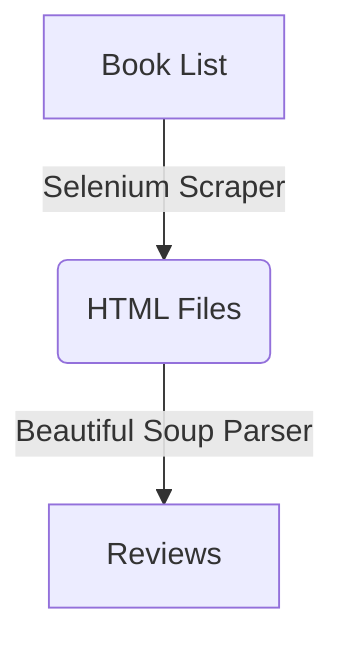

# Goodreads Review Scraper

## Overview

Avid readers face the challenge of deciding what books to read, and novice readers struggle with forming a reading habit. This has been the inspiration for many book clubs. Still, book clubs have to vet an ever expanding list of possible titles to read. This project was designed to create an efficient solution to finding and organizing reviews from a list of possible titles to read.

## How it Works



### Input


* The Python script reads in a ❎book_club_books.xlsx file and retrieves the book titles.
* The Selenium driver opens 📖goodreads.com and searches for the book title.
* The HTML for each book's landing page is scraped.
* The BeautifulSoup parser finds the 📃reviews in the HTML.
* The reviews are stored as spreadsheets in the 📂reviews folder.  

### Output


## Setup

### Prerequisites

* Python 3.11
  * pandas
  * selenium
  * bs4
  * time
  * io
  * os
* Install required Python packages using the following command:

  ```bash
  pip install -r requirements.txt

### Using the program

1. Upload a book list in a similar structure to the included spreadsheet.
   * pandas accepts a a two column spreadsheet in the format: "Title", "Author".
2. Run the script bookclub_scraper.py.
    ```bash
    python bookclub_scraper.py
3. The script will create a reviews folder in the directory.
   * Each book will have a spreadsheet with the first 30 reviews found on goodreads.

## Authors

Matt Dalgetty  
https://www.linkedin.com/in/matt-dalgetty-493a05166/

## Acknowledgments

This project was inspired by 
* [Natassha Selvaraj's blog](https://www.natasshaselvaraj.com/web-scraping/)
* [The PyCoach's Selenium tutorial](https://www.youtube.com/watch?v=UOsRrxMKJYk&t=1155s)
